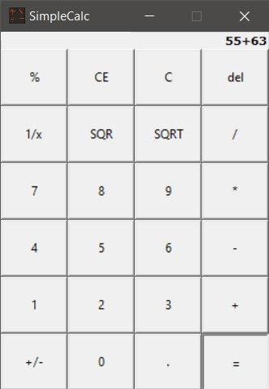

## SimpleCalc
SimpleCalc is a simple calculator application with a Graphical user interface that allows users to click on numbers and calculate the results efficiently. This project was implemented using Python and the Tkinter library.
### Screenshots:

#### Thank You for visiting!
